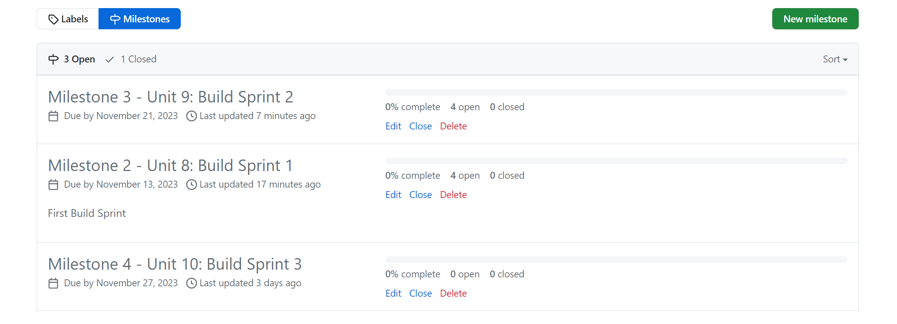
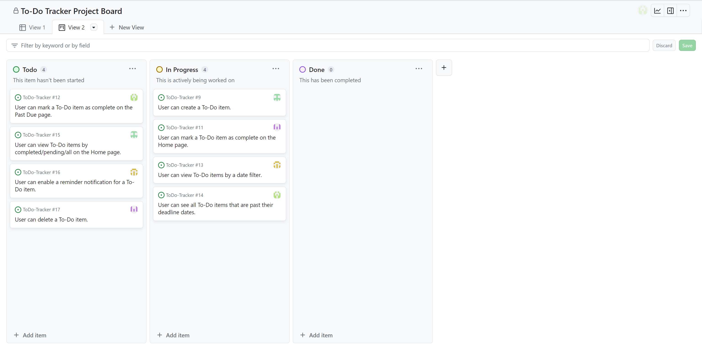
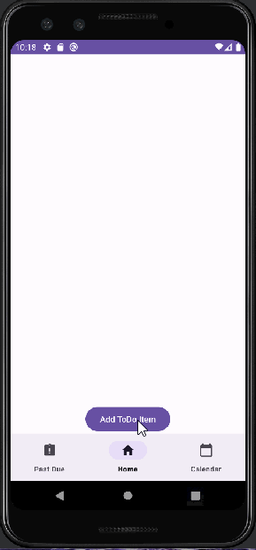

# Milestone 1 - To-Do Tracker (Unit 7)

## Table of Contents

1. [Overview](#Overview)
1. [Product Spec](#Product-Spec)
1. [Wireframes](#Wireframes)

## Overview

### Description

To-Do Tracker is a platform for users to keep track of tasks they want to execute with an associated deadline. It includes pages showing tasks to complete on each day, tasks that have been completed, tasks that are late, and a calendar view that gives access to tasks for each day.

### App Evaluation

- **Category:** Productivity
- **Mobile:** This app can provide a uniquely mobile experience by using features like real-time updates, notifications, and a calendar view to manage tasks.
- **Story:** The app’s story is compelling for anyone seeking task management and productivity enhancement. The value is clear to a broad audience, and friends or peers are likely to respond positively, as task management is a common need.
- **Market:** The market for this app is large, as task management is relevant to a wide range of people. It provides value to a broad audience.
- **Habit:** The habit-forming aspect depends on how well it keeps users engaged and reminds them of their tasks. If designed effectively, it can be habit-forming.
- **Scope:** The scope for this app appears well-formed and technically feasible. A stripped-down version with core task management features is still useful and interesting.

## Product Spec

### 1. User Features (Required and Optional)

**Required Features**

- [X] User can create a To-Do item.
	* To-Do item has the reminder text, deadline date, and reminder option (optional feature).
- [X] User can mark a To-Do item as complete.
- [X] User can view To-Do items by a date filter.
- [X] User can see all To-Do items that are past the deadline date.

**Optional Features**

- [ ] User can view To-Do items by completed/pending/all on the Home page.
- [ ] User can delete a To-Do item.

### 2. Screen Archetypes

- To-Do List Screen
  - User can see a list of items pending for a certain day. It shows items for "today" by default.
	- User can select whether to see all To-Do items, items marked as complete, or items not yet completed.
	- User can mark a To-Do item as complete.
	- User can launch the create To-Do screen.
  - User can delete a To-Do item.

- Calendar View Filter Screen
  - User can select a date to see To-Do items associated with it.

- Late To-Dos Screen
  - User can see a list of To-Do items that were not marked as complete past their deadline.
	- User can mark a To-Do item as complete.

- Create To-Do Screen
  - User can create a new To-Do item.
  - User can enable notification for a To-Do item.

### 3. Navigation

**Tab Navigation** (Tab to Screen)

* Pending To-Dos
* To-Dos by Day
* Late To-Dos

**Flow Navigation** (Screen to Screen)

- To-Do List Screen
  - => Create To-Do screen.

- Create To-Do screen
  - => To-Do List screen after saving a created To-Do item.

- Calendar View Filter Screen
  - => To-Do list screen after selecting what date to view. To-Do items for the date is shown on the To-Do screen.
 
- Late To-Dos Screen
  - => None.

## Wireframes

 

 

<!-- ### [BONUS] Digital Wireframes & Mockups -->

<!-- ### [BONUS] Interactive Prototype -->
 

# Milestone 2 - Build Sprint 1 (Unit 8)

## GitHub Project board

## Issue cards

## Issues worked on this sprint

- User can create a To-Do item.
- User can mark a To-Do item as complete on the Home page.
- User can view To-Do items by a date filter.
- User can see all To-Do items that are past their deadline dates.
  

 

# Milestone 3 - Build Sprint 2 (Unit 9)

## GitHub Project board

[Add screenshot of your Project Board with the updated status of issues for Milestone 3. Note that these should include the updated issues you worked on for this sprint and not be a duplicate of Milestone 2 Project board.] 

## Completed user stories

- List the completed user stories from this unit
- List any pending user stories / any user stories you decided to cut
from the original requirements
	- User can enable a reminder notification for a To-Do item (removed).

[Add video/gif of your current application that shows build progress]

## App Demo Video

- Embed the YouTube/Vimeo link of your Completed Demo Day prep video
